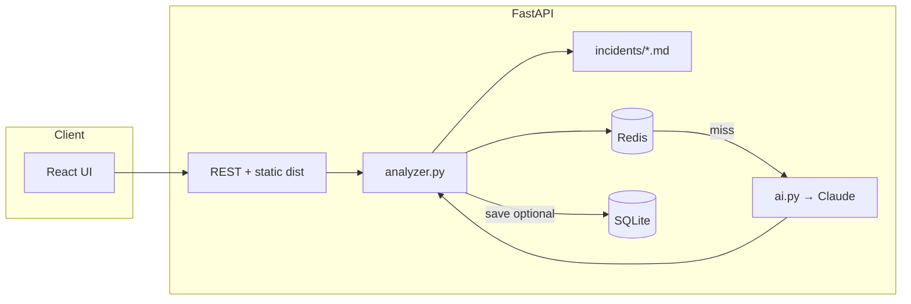
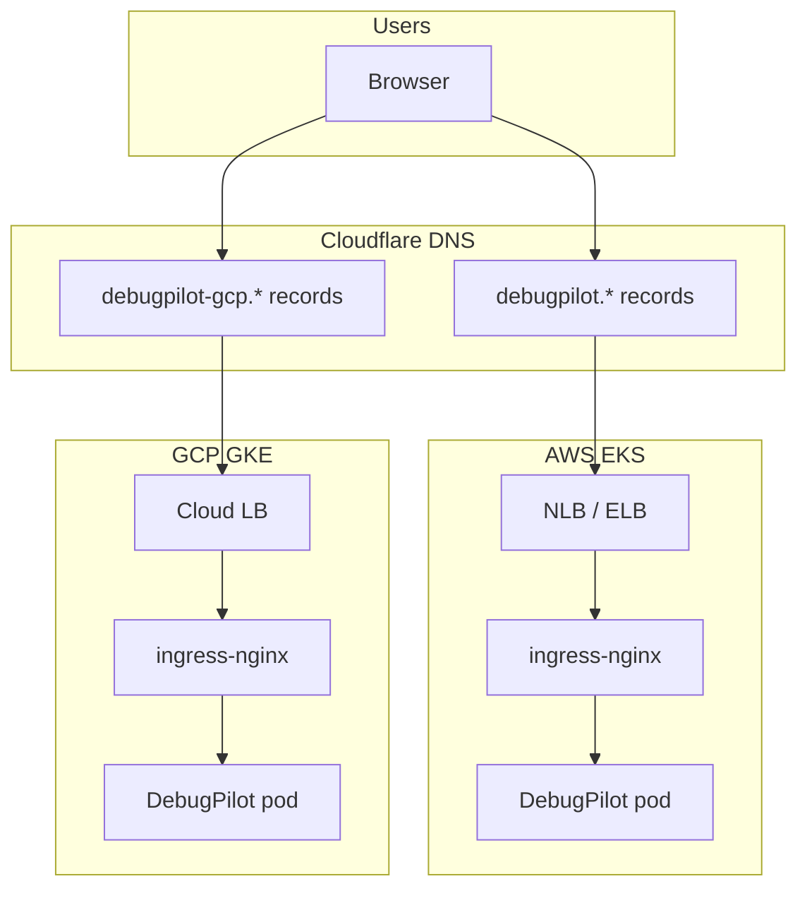

<h1 align="center">DebugPilot</h1>

<p align="center">
  <em>AI-powered DevOps incident debugger — paste infra logs, get root cause, safe commands, and fixes.</em>
</p>

<p align="center">
  <a href="https://debugpilot.manavmalavia.org">AWS demo</a> ·
  <a href="https://debugpilot-gcp.manavmalavia.org">GCP demo</a> ·
  <a href="#-quick-start-local">Local setup</a> ·
  <a href="#-multi-cloud-infrastructure">Multi-cloud</a> ·
  <a href="#-dns-external-dns-and-failover-behavior">DNS</a>
</p>

---

## Table of contents

- [Overview](#-overview)
- [Tech stack](#-tech-stack)
- [Multi-cloud infrastructure](#-multi-cloud-infrastructure)
- [Architecture](#-architecture)
- [How deployment works](#-how-deployment-works)
- [DNS, external-dns, and failover behavior](#-dns-external-dns-and-failover-behavior)
- [Quick start (local)](#-quick-start-local)
- [What an analysis returns](#-what-an-analysis-returns)
- [Project layout](#-project-layout)
- [Local development](#-local-development)
- [API reference](#-api-reference)
- [GitHub Actions](#-github-actions)
- [Operational runbooks](#-operational-runbooks)
- [Troubleshooting](#-troubleshooting)
- [Author](#-author)

---

## Overview

**DebugPilot** is a full-stack application for debugging infrastructure failures. Paste logs from **Kubernetes**, **Terraform**, **GitHub Actions**, or **Docker** and receive a structured diagnosis from **Claude**, enriched by markdown **playbooks** in `app/incidents/` (real incidents from multi-cloud deployments: Redis in K8s, ImagePullBackOff, Ingress 503, Terraform state lock, external-dns stale CNAME, and more).

The repository is both a **product** and a **platform showcase**: the same Helm chart and CI pipeline can run on **AWS EKS** or **GCP GKE**, with isolated DNS hostnames per cloud.

| Layer | Responsibility |
|--------|----------------|
| **Application** | FastAPI API, React ops UI, SQLite history, Redis analysis cache, Prometheus metrics |
| **Packaging** | Helm chart `charts/debugpilot`, multi-stage Docker image |
| **AWS** | EKS, ECR, VPC, ingress-nginx, external-dns, cert-manager, Argo CD |
| **GCP** | GKE, Artifact Registry, same platform components, separate hostnames |
| **Delivery** | GitHub Actions CI, GitOps sync, optional GitHub → Argo CD webhook |

---

## Tech stack

### Application layer

| Component | Technology | Role |
|-----------|------------|------|
| API | **Python 3.12**, **FastAPI** | REST endpoints, OpenAPI, static UI in production |
| AI | **Anthropic Claude** (`claude-sonnet-4-5`) | Log analysis with structured JSON output |
| Persistence | **SQLModel**, **SQLite** (`debugpilot.db`) | Saved incident history |
| Cache | **Redis** (`redis:7-alpine` in Helm / compose) | Identical log + `source_hint` → cached JSON (default 7-day TTL); skips repeat Claude calls |
| Metrics | **prometheus-fastapi-instrumentator** | `/metrics` for Prometheus scraping |
| UI | **React 19**, **Vite**, **Tailwind CSS 4** | Terminal-style ops console |
| HTTP client | **Axios** | Same-origin API in prod; `VITE_API_URL` for local dev |
| Testing | **pytest**, **ruff** | API tests and lint in CI |

### Container & build

| Component | Technology | Role |
|-----------|------------|------|
| Image | **Multi-stage Dockerfile** | Stage 1: `npm run build` → Stage 2: Python slim + `frontend/dist` |
| Registries | **AWS ECR**, **GCP Artifact Registry** | Same image tag pushed to both on `main` |
| Local | **docker-compose**, **start.sh** | Optional container or scripted dev environment |

### AWS platform (EKS)

| Component | Technology | Role |
|-----------|------------|------|
| Compute | **Amazon EKS 1.34**, managed node group (`t3.small`) | Kubernetes control plane and workers |
| Network | **VPC** (public subnets), **Internet Gateway** | Cluster networking |
| Registry | **ECR** `debugpilot-api` | Container images (bootstrap stack) |
| Ingress | **ingress-nginx** (NLB/ELB) | HTTP/S routing to services |
| DNS | **external-dns** + **Cloudflare** provider | Syncs Ingress hostnames → Cloudflare records |
| TLS | **cert-manager**, Let's Encrypt (`letsencrypt-prod`) | TLS secrets per hostname |
| GitOps | **Argo CD** | Syncs `charts/debugpilot` from GitHub `main` |
| Observability | **kube-prometheus-stack** | Prometheus + Grafana |
| IaC | **Terraform** (`terraform/aws/bootstrap`, `terraform/aws/cluster`) | Bootstrap vs cluster state split |

### GCP platform (GKE)

| Component | Technology | Role |
|-----------|------------|------|
| Compute | **Google GKE**, regional cluster | Parallel stack to AWS |
| Registry | **Artifact Registry** `debugpilot/debugpilot-api` | Same CI image tags as ECR |
| Network | **VPC** module (`terraform/gcp/modules/network`) | GKE networking |
| Ingress / DNS / TLS | Same pattern as AWS | **Different hostnames** (see below) |
| GitOps | **Argo CD** with `values-gcp.yaml` | Same chart, GCP-specific image registry path |
| IaC | **Terraform** (`terraform/gcp/foundation`, `terraform/gcp`) | Foundation (GAR, state) + cluster |

### CI/CD & GitOps

| Component | Technology | Role |
|-----------|------------|------|
| CI | **GitHub Actions** | Test, lint, Helm validate, buildx push amd64+arm64 |
| GitOps | **Argo CD** automated sync + self-heal | Cluster follows `charts/debugpilot` on `main` |
| Webhook | **GitHub → `/api/webhook`** | Near-instant refresh on push (vs ~3 min poll) |
| Deploy workflow | Manual dispatch | Optional rollout / image patch when not using Helm release |

---

## Multi-cloud infrastructure

DebugPilot is designed to run in **either** cloud without changing application code. Terraform and ingress manifests are **split by cloud** so AWS and GCP can coexist in the same Cloudflare zone without overwriting each other.

### Live endpoints

| Service | AWS (EKS) | GCP (GKE) |
|---------|-----------|-----------|
| **API** | https://debugpilot.manavmalavia.org | https://debugpilot-gcp.manavmalavia.org |
| **Grafana** | https://debugpilot-grafana.manavmalavia.org | https://debugpilot-gcp-grafana.manavmalavia.org |
| **Argo CD** | https://debugpilot-argocd.manavmalavia.org | https://debugpilot-gcp-argocd.manavmalavia.org |

### Isolation strategy

| Concern | AWS | GCP |
|---------|-----|-----|
| Terraform path | `terraform/aws/` | `terraform/gcp/` |
| Ingress manifests | `k8s/ingress/aws/` | `k8s/ingress/gcp/` |
| external-dns `txtOwnerId` | `debugpilot-aws` | `debugpilot-gcp` |
| DNS record prefix | `debugpilot`, `debugpilot-grafana`, … | `debugpilot-gcp`, `debugpilot-gcp-grafana`, … |
| Image registry | ECR | Artifact Registry |
| Helm values file | `charts/debugpilot/values.yaml` | `charts/debugpilot/values-gcp.yaml` |

CI pushes **one build** to **both** registries; each cluster’s Argo CD Application points at the registry and values file for that cloud.

### Terraform layout

```
terraform/
├── aws/
│   ├── bootstrap/          # ECR repository (long-lived)
│   └── cluster/            # VPC, EKS, Helm: ingress, external-dns, cert-manager,
│                           # monitoring, Argo CD, ingress YAML apply, Argo Application
└── gcp/
    ├── foundation/         # Artifact Registry, remote state bucket setup
    └── main.tf             # Network, GKE, same Helm platform pattern
```

### Typical bring-up order

**AWS**

1. `Terraform AWS Foundation` → ECR  
2. Merge to `main` → CI builds image and updates `values.yaml`  
3. `Terraform AWS Cluster` → **apply** → EKS + platform + Argo CD Application  
4. Verify DNS and `curl https://debugpilot.manavmalavia.org/health`

**GCP** (optional second region/cloud)

1. `Terraform GCP Foundation` → Artifact Registry + state  
2. `Terraform GCP Cluster` → **apply** → GKE + platform  
3. Verify https://debugpilot-gcp.manavmalavia.org  

You can run **one cloud or both**; destroying AWS does not remove GCP DNS records (separate `txtOwnerId` and hostnames).

### Greenfield after the rename (your flow)

1. Merge this branch, then create **new** remote state buckets matching `terraform/*/backend.tf` (`debugpilot-terraform-state-…`).
2. **AWS:** run `Terraform AWS Foundation` → apply (ECR `debugpilot-api`), then `Terraform AWS Cluster` → apply (new EKS cluster `debugpilot`).
3. **GCP:** create the GCS state bucket (see `terraform/gcp/README.md`), run `Terraform GCP Foundation` → apply, run CI on `main` (updates `values-gcp.yaml` when GAR exists), then `Terraform GCP Cluster` → apply.
4. Push to `main` so CI builds and tags `debugpilot-api` in both registries.
5. Delete stale Cloudflare `jobradar*` records. Add GitHub repo webhooks once per Argo URL (see [Argo CD GitHub webhook](#argocd-github-webhook)).

---

## Architecture

### Application flow



### Multi-cloud traffic (simplified)



---

## How deployment works

```
┌─────────────┐     push to main      ┌──────────────┐
│  Developer  │ ───────────────────►  │  GitHub CI   │
└─────────────┘                       │  test, build │
                                      │  push ECR+GAR│
                                      │  commit tag  │
                                      └──────┬───────┘
                                             │
                    webhook (optional)       │  values.yaml
                                             ▼
                                      ┌──────────────┐
                                      │   Argo CD    │
                                      │  helm sync   │
                                      └──────┬───────┘
                                             ▼
                                      ┌──────────────┐
                                      │ debugpilot-api │
                                      │ redis        │
                                      └──────────────┘
```

| Phase | Tool | What happens |
|-------|------|----------------|
| **Build** | GitHub Actions CI | pytest, ruff, frontend build, Docker buildx, push to ECR + GAR |
| **Config git** | CI bot commit | Updates `charts/debugpilot/values.yaml` image digest on `main` |
| **Sync** | Argo CD | Renders Helm chart → applies API, **Redis**, Service, HPA, ServiceMonitor |
| **Platform** | Terraform (manual) | Cluster, ingress controller, external-dns, cert-manager, Argo CD install |
| **Edge** | Cloudflare + external-dns | Hostname → load balancer IP/CNAME per cloud |

**Day-to-day:** push application changes to `main` — CI and Argo CD handle the rest. Re-run Terraform only for infrastructure changes.

---

## DNS, external-dns, and failover behavior

DNS is the **edge** of the system: users hit Cloudflare hostnames that must point at the **current** cloud load balancer. This project uses **external-dns** in each cluster to reconcile Ingress hosts into Cloudflare.

### How records are created

1. **ingress-nginx** provisions a cloud load balancer (AWS ELB/NLB or GCP forwarding rule).
2. **Ingress** resources in `k8s/ingress/aws/` or `k8s/ingress/gcp/` annotate desired hostnames:

   ```yaml
   external-dns.alpha.kubernetes.io/hostname: debugpilot.manavmalavia.org
   external-dns.alpha.kubernetes.io/cloudflare-proxied: "false"
   ```

3. **external-dns** (Helm release in cluster) watches Ingress objects and creates/updates **CNAME** (AWS) or **A** (GCP) records in Cloudflare.
4. **TXT records** (`cname-debugpilot...`) record ownership (`txtOwnerId`: `debugpilot-aws` vs `debugpilot-gcp`) so each cluster only manages its own records.

### AWS vs GCP record shapes

| Cloud | Typical record type | Points to |
|-------|---------------------|-----------|
| **AWS** | CNAME | `*.elb.amazonaws.com` hostname from Ingress status |
| **GCP** | A | Static IP or LB IP for the GKE ingress |

Always verify with:

```bash
# AWS — compare Ingress vs DNS
kubectl get ingress debugpilot-ingress -o jsonpath='{.status.loadBalancer.ingress[0].hostname}{"\n"}'
dig debugpilot.manavmalavia.org CNAME +short

# GCP
kubectl get ingress debugpilot-ingress -n default
dig debugpilot-gcp.manavmalavia.org +short
```

### Failover and recreation scenarios

“Failover” here means **recovering correct DNS after infrastructure changes** — not automatic multi-cloud active-active failover between AWS and GCP (those are **parallel stacks**, not hot standby).

| Scenario | What goes wrong | What to do |
|----------|-----------------|------------|
| **EKS recreated** | New ELB hostname; Cloudflare still has **old** CNAME | Run destroy workflow (deletes Ingress first, waits for external-dns), or delete stale CNAMEs and restart external-dns |
| **external-dns says “up to date” but DNS is wrong** | Records exist without matching TXT ownership from current cluster | Delete `debugpilot` / `debugpilot-grafana` / `debugpilot-argocd` CNAMEs + `cname-debugpilot*` TXT; restart external-dns deployment |
| **503 / NXDOMAIN** | DNS not pointing at live LB, or cert still issuing | Fix DNS first; wait for cert-manager; confirm pods Ready |
| **Destroy AWS, keep GCP** | AWS records should disappear; GCP `debugpilot-gcp*` unaffected | Confirm destroy workflow ran ingress cleanup; manually remove orphaned AWS records if needed |
| **Both clouds up** | No conflict if hostnames stay prefixed (`debugpilot` vs `debugpilot-gcp`) | Do not reuse the same hostname across clusters |

### Destroy-time DNS cleanup (AWS / GCP)

**Terraform AWS Cluster → destroy** and **Terraform GCP Cluster → destroy** run a pre-step:

1. `kubectl delete -f k8s/ingress/{aws|gcp}/...` (app, Grafana, Argo CD ingresses)
2. Wait ~90s for external-dns to **delete** Cloudflare records
3. `terraform destroy`

This prevents **stale CNAMEs** pointing at deleted load balancers after cluster teardown.

### Manual DNS recovery checklist

```bash
# 1. Confirm load balancer exists
kubectl get ingress -A

# 2. Check external-dns
kubectl logs -n external-dns deployment/external-dns --tail=50

# 3. Compare DNS
dig debugpilot.manavmalavia.org CNAME +short
dig debugpilot-gcp.manavmalavia.org +short

# 4. If stale — delete wrong records in Cloudflare, then:
kubectl rollout restart deployment/external-dns -n external-dns
```

Full playbook: [`app/incidents/external-dns-stale-cname.md`](app/incidents/external-dns-stale-cname.md)

---

## Quick start (local)

Run the full product on your laptop — **no Kubernetes required**.

### Prerequisites

| Tool | Version |
|------|---------|
| Python | 3.12+ |
| Node.js | 22+ |
| Anthropic API key | [console.anthropic.com](https://console.anthropic.com/) |
| Redis (optional) | 7+ — caches repeat analyses; omit `REDIS_URL` to call Claude every time |

### Steps

```bash
git clone https://github.com/manavmalavia18/JobTracker.git
cd JobTracker
cp .env.example .env
# Edit .env — set ANTHROPIC_API_KEY
# Optional: REDIS_URL=redis://localhost:6379/0 (run Redis locally or use docker compose)

chmod +x start.sh
./start.sh
```

**With Redis (recommended for dev):** API + Redis in one command:

```bash
docker compose up --build
```

Uses `REDIS_URL=redis://redis:6379/0` from compose. UI still via `./start.sh` or http://localhost:8000 after building the frontend.

- UI: http://localhost:5173  
- API: http://localhost:8000  
- Docs: http://localhost:8000/docs  

Try a **sample log** in the UI, or:

```bash
curl http://localhost:8000/health
```

Stop with `Ctrl+C` in the terminal running `start.sh`.

---

## What an analysis returns

- **Category** — kubernetes, terraform, github_actions, docker, app, unknown  
- **Symptom**, **what failed**, **root cause**, **confidence**  
- **Debug commands** — prefer read-only; destructive steps listed in **warnings**  
- **Likely fix**, **prevention** tips  
- Optional **save** to history (SQLite)

**Caching:** If `REDIS_URL` is set, the same log text and `source_hint` returns the cached analysis (no Claude tokens). `POST /analyze` includes `cached` (boolean) and `duration_ms` so the UI and metrics can show Redis vs Claude. Prometheus counters: `debugpilot_analysis_cache_hits_total`, `debugpilot_analysis_cache_misses_total`. Cache key includes model and `ANALYSIS_CACHE_VERSION` — bump that env var when changing prompts or playbooks. Default TTL: 7 days (`REDIS_CACHE_TTL_SECONDS`).

Playbooks under `app/incidents/` are keyword-matched to ground the model in real failure modes from this repo’s infra.

---

## Project layout

```
├── app/                    # FastAPI backend + playbooks
├── frontend/               # React UI
├── charts/debugpilot/        # Helm (values.yaml + values-gcp.yaml)
├── k8s/ingress/aws|gcp/  # Per-cloud Ingress + TLS
├── terraform/aws|gcp/      # Multi-cloud IaC
├── .github/workflows/      # CI, Deploy, Terraform
├── tests/
├── Dockerfile
└── start.sh
```

---

## Local development

| Mode | Command |
|------|---------|
| All-in-one script | `./start.sh` |
| API + Redis (compose) | `docker compose up --build` |
| API only | `uvicorn app.main:app --reload --port 8000` |
| UI dev server | `cd frontend && npm run dev` |
| Prod-like (UI from API) | `cd frontend && npm run build && uvicorn app.main:app --port 8000` |
| Tests | `pytest tests/ -v` |

### Redis (local & Kubernetes)

| Setting | Default | Purpose |
|---------|---------|---------|
| `REDIS_URL` | unset locally | e.g. `redis://localhost:6379/0` or `redis://redis:6379/0` in cluster |
| `REDIS_CACHE_TTL_SECONDS` | `604800` (7 days) | How long cached analyses live |
| `ANALYSIS_CACHE_VERSION` | `1` | Bump to invalidate cache after prompt/playbook changes |

In **Kubernetes**, Helm deploys a `redis` Service (`charts/debugpilot/templates/redis.yaml`) when `redis.enabled: true`. The API uses cluster DNS `redis://redis:6379/0` — not `localhost` (see playbook `redis-localhost-k8s.md` for misconfigured *other* apps).

Frontend dev uses `frontend/.env.development` (`VITE_API_URL=http://localhost:8000`). Production build uses **same-origin** `/analyze` (no localhost in the bundle).

---

## API reference

| Method | Path | Description |
|--------|------|-------------|
| `GET` | `/health` | Health check |
| `GET` | `/auth/config` | Whether GitHub login is required |
| `GET` | `/auth/me` | Current user (session cookie) |
| `GET` | `/auth/github/login` | Start GitHub OAuth |
| `POST` | `/auth/logout` | Clear session |
| `POST` | `/analyze` | Analyze log text; response adds `cached`, `duration_ms` (auth if OAuth configured) |
| `GET` | `/incidents` | List saved analyses |
| `GET` | `/incidents/{id}` | Get one analysis |
| `GET` | `/metrics` | Prometheus metrics |
| `GET` | `/docs` | OpenAPI |

---

## GitHub Actions

| Workflow | Trigger | Purpose |
|----------|---------|---------|
| **CI** | Push / PR → `main`, or **Run workflow** | Test, ruff, Helm lint, build & push image, update `values.yaml` / `values-gcp.yaml` |
| **Deploy** | Manual | Optional rollout / image patch (Argo CD–managed clusters) |
| **Terraform AWS Foundation** | Manual | ECR |
| **Terraform AWS Cluster** | Manual | plan / apply / destroy EKS |
| **Terraform GCP Foundation** | Manual | Artifact Registry + state |
| **Terraform GCP Cluster** | Manual | plan / apply / destroy GKE |

### Repository secrets (Terraform / CI)

| Secret | Used by |
|--------|---------|
| `ARGOCD_GITHUB_WEBHOOK_SECRET` | Terraform AWS/GCP cluster apply — pins `webhook.github.secret` in Argo CD Helm so cluster rebuilds match the GitHub webhook |
| `ANTHROPIC_API_KEY` | Terraform cluster apply (K8s secret), local `.env` |
| `GITHUB_OAUTH_CLIENT_ID_AWS` | GitHub OAuth App for **AWS** hostname (Terraform AWS Cluster) |
| `GITHUB_OAUTH_CLIENT_SECRET_AWS` | OAuth secret for AWS |
| `GITHUB_OAUTH_CLIENT_ID_GCP` | GitHub OAuth App for **GCP** hostname (Terraform GCP Cluster) |
| `GITHUB_OAUTH_CLIENT_SECRET_GCP` | OAuth secret for GCP |
| `JWT_SECRET` | Session cookie signing — **same value on both clouds** (`openssl rand -hex 32`) |

### GitHub sign-in (abuse protection)

When `GITHUB_CLIENT_ID` and `GITHUB_CLIENT_SECRET` are set on the API (via `debugpilot-secrets`), `/analyze` and `/incidents` require a GitHub login. Sessions use an httpOnly cookie (7 days).

GitHub OAuth Apps allow **one callback URL per app**, so use **two OAuth Apps** if AWS and GCP can both be live (failover). Use the **same** `JWT_SECRET` in both clusters.

| Cloud | OAuth App callback URL | Helm `publicBaseUrl` |
|-------|------------------------|----------------------|
| **AWS** | `https://debugpilot.manavmalavia.org/auth/github/callback` | `charts/debugpilot/values.yaml` |
| **GCP** | `https://debugpilot-gcp.manavmalavia.org/auth/github/callback` | `charts/debugpilot/values-gcp.yaml` |
| **Local** | `http://localhost:8000/auth/github/callback` | `.env` / `PUBLIC_BASE_URL` |

1. Create [GitHub OAuth Apps](https://github.com/settings/developers) (**OAuth App**, not GitHub App). **Do not enable device flow.**
2. Add repo secrets: `GITHUB_OAUTH_CLIENT_ID_AWS`, `GITHUB_OAUTH_CLIENT_SECRET_AWS`, `GITHUB_OAUTH_CLIENT_ID_GCP`, `GITHUB_OAUTH_CLIENT_SECRET_GCP`, `JWT_SECRET`.
3. Run **Terraform AWS Cluster** and **Terraform GCP Cluster** apply (each writes OAuth keys into that cluster’s `debugpilot-secrets`), or patch manually:

   ```bash
   # AWS example (namespace default)
   kubectl patch secret debugpilot-secrets --type merge -p '{
     "stringData": {
       "GITHUB_CLIENT_ID": "aws-oauth-client-id",
       "GITHUB_CLIENT_SECRET": "aws-oauth-client-secret",
       "JWT_SECRET": "shared-jwt-secret"
     }
   }'
   kubectl rollout restart deployment/debugpilot-api
   ```

4. Argo syncs the chart; each cloud uses its own `publicBaseUrl` + `authCookieSecure: true`.

**Only one cloud up?** Create one OAuth App for that hostname and set only that cloud’s `_AWS` or `_GCP` repo secrets.

Local dev without OAuth: leave `GITHUB_CLIENT_ID` unset — API uses a built-in `dev` user. Set `AUTH_DISABLED=1` to force dev mode even if OAuth env vars exist.

### Argo CD GitHub webhook

Terraform sets `configs.secret.githubSecret` when `ARGOCD_GITHUB_WEBHOOK_SECRET` (or `TF_VAR_argocd_github_webhook_secret` locally) is set. Use the **same** value you configured in GitHub.

| Cloud | Webhook payload URL |
|-------|---------------------|
| GCP | `https://debugpilot-gcp-argocd.manavmalavia.org/api/webhook` |
| AWS | `https://debugpilot-argocd.manavmalavia.org/api/webhook` |

**One-time per URL:** create the webhook in GitHub (push events, shared secret). After cluster destroy/recreate, run Terraform apply only — no `kubectl patch` if the secret and URL are unchanged.

Local apply:

```bash
export TF_VAR_argocd_github_webhook_secret='your-existing-secret'
```

---

## Operational runbooks

Markdown guides in `app/incidents/`:

| Playbook | Topic |
|----------|--------|
| `external-dns-stale-cname.md` | DNS drift after cluster recreate |
| `ingress-503.md` | Ingress up, backend unhealthy |
| `image-pull-backoff.md` | ECR/GAR image mismatch |
| `cert-manager-tls.md` | TLS / ACME issues |
| `terraform-state-lock.md` | State lock during apply |
| `redis-localhost-k8s.md` | Redis URL in K8s |
| `github-actions-kubeconfig.md` | CI cluster access |

---

## Troubleshooting

| Symptom | Likely cause | Pointer |
|---------|----------------|---------|
| `Could not resolve host` | Stale Cloudflare CNAME | [DNS section](#-dns-external-dns-and-failover-behavior) |
| **503** from nginx | No ready endpoints | `kubectl get pods -l app=debugpilot-api` |
| Argo CD **OutOfSync** | Git vs cluster drift | Sync in UI; check repo path |
| CORS / localhost from live site | Old frontend bundle | Use current `main` (same-origin API) |
| GCP works, AWS doesn’t | Separate hostnames / records | Verify `debugpilot` vs `debugpilot-gcp` records independently |
| Every analyze hits Claude | Redis missing or wrong URL | `kubectl get pods -l app=redis`; confirm `REDIS_URL=redis://redis:6379/0` on API deployment |

---

## Author

**Manav Malavia** — [manavmalavia.org](https://manavmalavia.org) · [GitHub](https://github.com/manavmalavia18/JobTracker)

---

<p align="center">
  <sub>FastAPI · React · Claude · Terraform · AWS EKS · GCP GKE · Helm · Argo CD · external-dns</sub>
</p>
