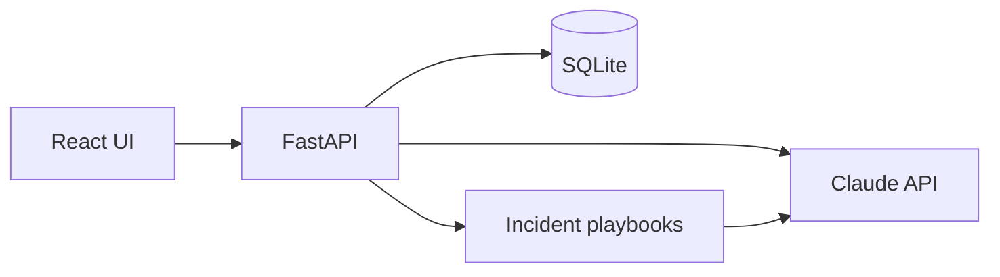
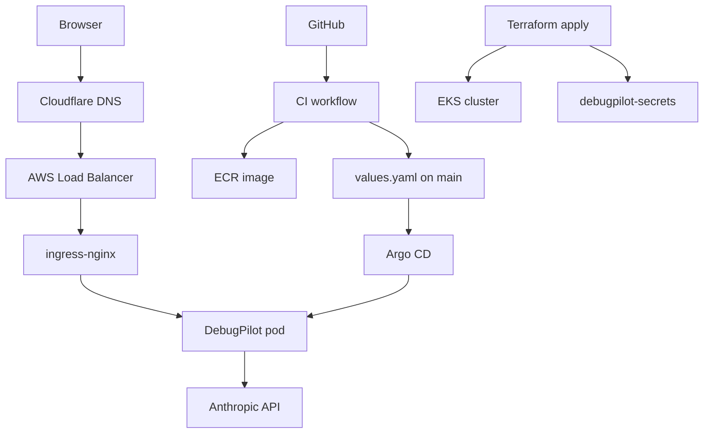

<p align="center">
  <strong>DebugPilot</strong><br/>
  <em>AI-powered DevOps incident debugger — paste infra logs, get root cause, safe commands, and fixes.</em>
</p>

<p align="center">
  <a href="https://jobradar.manavmalavia.org">Live demo</a> ·
  <a href="#-run-it-locally-in-5-minutes-recruiter-quick-start">Quick start</a> ·
  <a href="#-architecture">Architecture</a> ·
  <a href="#-api-reference">API</a>
</p>

---

## Table of contents

- [What is this?](#-what-is-this)
- [Run it locally in 5 minutes (recruiter quick start)](#-run-it-locally-in-5-minutes-recruiter-quick-start)
- [What you get when you analyze a log](#-what-you-get-when-you-analyze-a-log)
- [Tech stack](#-tech-stack)
- [Architecture](#-architecture)
- [How deployment works (GitOps)](#-how-deployment-works-gitops)
- [Project layout](#-project-layout)
- [Local development (all options)](#-local-development-all-options)
- [API reference](#-api-reference)
- [Production & infrastructure](#-production--infrastructure)
- [GitHub Actions workflows](#-github-actions-workflows)
- [Troubleshooting](#-troubleshooting)
- [Author](#-author)

---

## What is this?

**DebugPilot** is a full-stack app that helps you debug real infrastructure failures. Paste a log snippet from Kubernetes, Terraform, GitHub Actions, or Docker — Claude returns a structured diagnosis grounded in **playbooks** written from actual production incidents (Redis on localhost in K8s, ImagePullBackOff, Ingress 503, Terraform state lock, and more).

| Layer | What it demonstrates |
|--------|----------------------|
| **Application** | FastAPI + React, Claude API, SQLite history, Prometheus metrics |
| **Platform** | Multi-cloud Terraform (AWS EKS + GCP GKE), Helm, Argo CD GitOps |
| **Delivery** | GitHub Actions CI/CD, ECR/GAR images, external-dns, cert-manager, webhooks |

**Live URLs** (when the AWS cluster is up):

| Service | URL |
|---------|-----|
| App | https://jobradar.manavmalavia.org |
| Grafana | https://jobradar-grafana.manavmalavia.org |
| ArgoCD | https://jobradar-argocd.manavmalavia.org |

> Infra resource names still use the `jobradar` prefix from the original project; the product is **DebugPilot**.

---

## Run it locally in 5 minutes (recruiter quick start)

No Kubernetes required. You only need **Python 3.12**, **Node 22**, and an **Anthropic API key**.

### 1. Clone and configure

```bash
git clone https://github.com/manavmalavia18/JobTracker.git
cd JobTracker
cp .env.example .env
```

Open `.env` and set your key:

```env
ANTHROPIC_API_KEY=sk-ant-...
```

### 2. Start everything

```bash
chmod +x start.sh
./start.sh
```

This script:

- Creates a Python venv and installs dependencies
- Starts the API on **http://127.0.0.1:8000**
- Starts the UI on **http://127.0.0.1:5173** (hot reload)

### 3. Try it

1. Open **http://localhost:5173**
2. Pick a **sample log** (Kubernetes, Terraform, GitHub Actions, Docker)
3. Click **Analyze**
4. Review root cause, debug commands, fix steps, and confidence level

**API-only check:**

```bash
curl http://localhost:8000/health
# {"status":"ok","service":"debugpilot"}

curl -X POST http://localhost:8000/analyze \
  -H "Content-Type: application/json" \
  -d '{"log_text":"Error: ImagePullBackOff","source_hint":"kubernetes","save":true}'
```

**Stop:** `Ctrl+C` in the terminal running `start.sh`.

### Prerequisites checklist

| Tool | Version | Install |
|------|---------|---------|
| Python | 3.12+ | [python.org](https://www.python.org/downloads/) |
| Node.js | 22+ | [nodejs.org](https://nodejs.org/) |
| Anthropic API key | — | [console.anthropic.com](https://console.anthropic.com/) |

Optional: `docker compose up --build` if you prefer Docker (requires `.env`).

---

## What you get when you analyze a log

The UI returns a structured ops-style report:

- **Category** — kubernetes, terraform, github_actions, docker, app, unknown
- **Symptom** — one-line summary
- **What failed** — component or step
- **Root cause** — plain-English explanation
- **Confidence** — high / medium / low
- **Debug commands** — read-only first; destructive ones flagged in warnings
- **Likely fix** — concrete remediation steps
- **Prevention** — how to avoid repeat incidents

Analyses can be **saved** to SQLite and browsed in the **History** tab.

Built-in playbooks live in `app/incidents/` and are matched by keywords before/alongside the LLM call.

---

## Tech stack

| Area | Technologies |
|------|----------------|
| **Backend** | Python 3.12, FastAPI, SQLModel, SQLite, Anthropic Claude (`claude-sonnet-4-5`) |
| **Frontend** | React 19, Vite, Tailwind CSS 4, Axios |
| **Observability** | Prometheus metrics (`/metrics`), kube-prometheus-stack in cluster |
| **Containers** | Multi-stage Dockerfile (Node build → Python slim) |
| **AWS** | EKS, ECR, VPC, external-dns → Cloudflare, cert-manager, ingress-nginx |
| **GCP** | GKE, Artifact Registry (optional second cloud) |
| **IaC** | Terraform (bootstrap + cluster split) |
| **GitOps** | Argo CD + Helm chart `charts/jobradar` |
| **CI/CD** | GitHub Actions — test, lint, build, push, update image tag in git |

---

## Architecture

### Application (logical)



### Production (AWS)



---

## How deployment works (GitOps)

Plain-language flow:

1. **You push to `main`** → CI runs tests, builds the Docker image, pushes to ECR, commits the new image tag to `charts/jobradar/values.yaml`.
2. **GitHub webhook** → Argo CD sees the git change within seconds and syncs the Helm chart to the cluster.
3. **Terraform apply** (manual, rare) → Creates EKS, ingress, DNS, TLS, monitoring, Argo CD, **`debugpilot-secrets`** from GitHub `ANTHROPIC_API_KEY`, and registers the Argo CD Application.

**Day-to-day:** push code → CI → Argo CD. **No manual Deploy** needed for normal releases.

| Step | Who runs it | What happens |
|------|-------------|----------------|
| Build image | CI (automatic) | Docker → ECR + GAR |
| Update git tag | CI (automatic) | `values.yaml` commit on `main` |
| Deploy app | Argo CD (automatic) | Helm sync → new pods |
| Create cluster | You → Terraform AWS | EKS + platform + secret |
| Restart / key rotate | Optional Deploy workflow | Secret + rollout |

---

## Project layout

```
JobTracker/
├── app/                      # FastAPI backend
│   ├── main.py               # Routes, static UI, metrics
│   ├── ai.py                 # Claude prompts & API calls
│   ├── analyzer.py           # Playbook matching + orchestration
│   ├── models.py             # Pydantic / SQLModel schemas
│   ├── database.py           # SQLite (debugpilot.db)
│   └── incidents/            # Markdown playbooks (seed knowledge)
├── frontend/                 # React ops console UI
│   ├── src/components/       # Analyze, History, KPI cards, Sidebar
│   └── src/data/samples.js   # Demo log snippets
├── charts/jobradar/          # Helm chart (Deployment, Service, HPA, ServiceMonitor)
├── k8s/ingress/              # AWS + GCP Ingress + TLS
├── terraform/
│   ├── aws/bootstrap/        # ECR repository
│   ├── aws/cluster/          # EKS + platform Helm releases
│   └── gcp/                  # GKE + foundation (optional)
├── .github/workflows/        # CI, Deploy, Terraform
├── tests/                    # pytest API tests
├── Dockerfile                # Production image
├── start.sh                  # Local dev entrypoint
└── docker-compose.yaml       # Optional Docker local run
```

---

## Local development (all options)

### Option A — One command (recommended)

```bash
./start.sh
```

### Option B — Backend only

```bash
python -m venv .venv && source .venv/bin/activate
pip install -r requirements.txt
cp .env.example .env   # add ANTHROPIC_API_KEY
uvicorn app.main:app --reload --port 8000
```

API docs: http://localhost:8000/docs

### Option C — Frontend dev server (separate terminal)

```bash
cd frontend && npm install && npm run dev
```

Uses `frontend/.env.development` → API at `http://localhost:8000`.

### Option D — Production-like (UI served from API)

```bash
cd frontend && npm ci && npm run build
cd .. && source .venv/bin/activate && uvicorn app.main:app --reload --port 8000
```

Open http://localhost:8000 (same as production routing).

### Run tests

```bash
pip install -r requirements.txt
pytest tests/ -v
cd frontend && npm ci && npm run build
```

---

## API reference

| Method | Path | Description |
|--------|------|-------------|
| `GET` | `/` | Serves built React UI (production) or API info (dev) |
| `GET` | `/health` | `{"status":"ok","service":"debugpilot"}` |
| `POST` | `/analyze` | Analyze log text with Claude |
| `GET` | `/incidents` | List saved analyses |
| `GET` | `/incidents/{id}` | Get one saved analysis |
| `GET` | `/metrics` | Prometheus metrics |
| `GET` | `/docs` | OpenAPI (Swagger) |

**Example analyze request:**

```json
{
  "log_text": "Back-off pulling image \"my-app:badtag\"",
  "source_hint": "kubernetes",
  "save": true
}
```

---

## Production & infrastructure

### GitHub secrets (for cloud deploy)

| Secret | Used by |
|--------|---------|
| `ANTHROPIC_API_KEY` | Terraform apply → `debugpilot-secrets`; optional Deploy |
| `AWS_ACCESS_KEY_ID` / `AWS_SECRET_ACCESS_KEY` / `AWS_REGION` / `AWS_ACCOUNT_ID` | Terraform, CI, Deploy |
| `CLOUDFLARE_API_TOKEN` | external-dns (Terraform) |
| `GCP_SA_KEY` / `GCP_PROJECT_ID` / `GCP_REGION` | GCP path (optional) |

### First-time AWS bring-up (maintainers)

1. **Terraform AWS Bootstrap** — ECR repo  
2. Merge to **`main`** — CI builds and pushes image  
3. **Terraform AWS → apply** — cluster + Argo CD + secret  
4. Confirm DNS: `dig jobradar.manavmalavia.org CNAME +short`  
5. Open https://jobradar.manavmalavia.org/health  

### Kubernetes secret

Terraform apply creates `debugpilot-secrets` automatically from `ANTHROPIC_API_KEY`.

Manual fallback:

```bash
kubectl create secret generic debugpilot-secrets \
  --from-literal=ANTHROPIC_API_KEY=your-key
```

See `app/incidents/` for operational runbooks (DNS stale CNAME, 503, ImagePullBackOff, etc.).

---

## GitHub Actions workflows

| Workflow | Trigger | Purpose |
|----------|---------|---------|
| **CI** | Push / PR to `main` | Test, ruff, helm lint, build & push image, update `values.yaml` |
| **Deploy** | Manual | Optional secret refresh + pod restart |
| **Terraform AWS** | Manual | Plan / apply / destroy EKS stack |
| **Terraform AWS Bootstrap** | Manual | ECR repository |
| **Terraform GCP** | Manual | GKE stack (optional) |
| **Terraform GCP Foundation** | Manual | GAR + state bucket |

---

## Troubleshooting

| Problem | Likely cause | Fix |
|---------|----------------|-----|
| `Analyze` fails locally | Missing API key | Set `ANTHROPIC_API_KEY` in `.env` |
| CORS / localhost from HTTPS site | Old frontend build | Use latest `main`; production uses same-origin `/analyze` |
| **503** on live URL | Pod not ready | `kubectl get pods -l app=jobradar-api`; check `debugpilot-secrets` |
| DNS doesn’t resolve | Stale Cloudflare CNAME | See `app/incidents/external-dns-stale-cname.md` |
| Argo CD **OutOfSync** | Git / cluster drift | Sync in Argo CD UI or fix git |

---

## Author

**Manav Malavia** — platform engineer portfolio project  

- Website: [manavmalavia.org](https://manavmalavia.org)  
- Repo: [github.com/manavmalavia18/JobTracker](https://github.com/manavmalavia18/JobTracker)

If you’re reviewing this as a recruiter or hiring manager: clone → `./start.sh` → open localhost:5173 → run a sample analysis. That exercises the full product without any cloud account.

---

<p align="center">
  <sub>Built with FastAPI, React, Claude, Terraform, Kubernetes, Helm, and Argo CD.</sub>
</p>
