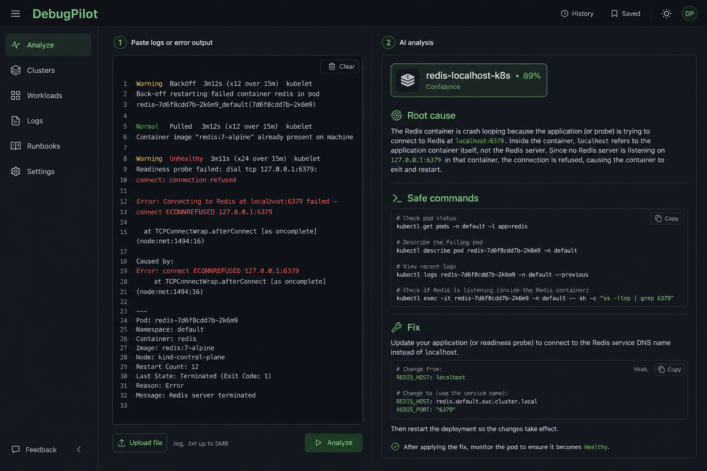
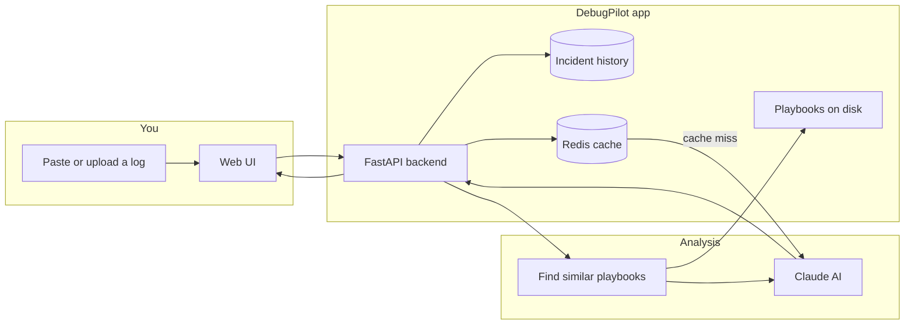

<h1 align="center">DebugPilot</h1>

<p align="center">
  <strong>Your AI copilot for infrastructure failures.</strong><br/>
  <em>Paste a messy log from Kubernetes, Terraform, CI, or Docker — get a clear explanation, safe commands, and a fix plan.</em>
</p>

<p align="center">
  <a href="https://debugpilot.manavmalavia.org">Live demo (AWS)</a> ·
  <a href="https://debugpilot-gcp.manavmalavia.org">Live demo (GCP)</a> ·
  <a href="#getting-started-locally">Run it locally</a> ·
  <a href="#how-it-works">How it works</a>
</p>

<p align="center">
  
</p>

---

## Table of contents

- [What is DebugPilot?](#what-is-debugpilot)
- [Who is this for?](#who-is-this-for)
- [The problem it solves](#the-problem-it-solves)
- [How it works](#how-it-works)
- [Core features](#core-features)
- [How the AI side works](#how-the-ai-side-works)
- [Architecture](#architecture)
- [What's in this repository](#whats-in-this-repository)
- [Tech stack](#tech-stack)
- [Getting started locally](#getting-started-locally)
- [What an analysis returns](#what-an-analysis-returns)
- [Running in production (multi-cloud)](#running-in-production-multi-cloud)
- [DNS and external-dns](#dns-and-external-dns)
- [API reference](#api-reference)
- [GitHub Actions and secrets](#github-actions-and-secrets)
- [Operational playbooks](#operational-playbooks)
- [Troubleshooting](#troubleshooting)
- [Author](#author)

---

## What is DebugPilot?

**DebugPilot** is a web application that helps you understand **why something broke** in your infrastructure.

When a deployment fails, a pod crashes, Terraform locks state, or a GitHub Actions job exits with code 1, you usually get a wall of text — stack traces, kubectl output, provider errors. Reading that under pressure is hard, especially if you're still learning DevOps.

DebugPilot takes that log text and returns a **structured report**:

- What **symptom** you are seeing  
- What **actually failed**  
- The most likely **root cause**  
- **Commands** you can run to investigate further (read-only first)  
- A **likely fix** and **prevention** tips  

It is built for **real ops work**, not toy demos. The same codebase runs on your laptop for development and on **AWS EKS** or **Google GKE** in production.

---

## Who is this for?

| You are… | How DebugPilot helps |
|----------|----------------------|
| **Learning DevOps** | Turn cryptic logs into plain explanations you can learn from |
| **A platform / SRE engineer** | Speed up triage; save resolutions so similar failures get faster answers |
| **A builder showing your work** | Full-stack app + AI + Kubernetes + Terraform + CI — one cohesive project |
| **Someone on call** | Paste or upload a log, get commands and context without starting from zero |

You do **not** need to understand every tool in the stack to *use* the app. You paste a log and read the result. The README below explains how the pieces fit together if you want to go deeper.

---

## The problem it solves

Infrastructure failures share a pattern:

1. Something breaks (deploy, pipeline, cluster, DNS, cert, database connection…).  
2. A tool prints a **log** — often long, noisy, and unfamiliar.  
3. You search docs, Slack, or Google while production or your interview demo waits.  
4. You might fix it once and forget *why* it worked.

DebugPilot shortens step 3 and remembers step 4.

It does **not** replace your judgment. It gives you a **first pass**: categorized failure, suggested commands, and links to internal **playbooks** (markdown guides written from real incidents on this project). You confirm before running anything destructive.

---

## How it works

Think of three layers: **you**, the **app**, and the **AI + knowledge base**.



### Step-by-step: analyzing a log

1. **Open the UI** — locally at http://localhost:5173 or the live demo URLs above.  
2. **Paste log text** or **upload** a `.log` / `.txt` file (max 512 KB).  
3. **Optional:** pick a source hint (Kubernetes, Terraform, GitHub Actions, Docker). If you skip this, the app guesses from keywords in the log.  
4. **Click Analyze.** The backend:
   - Detects the log type (e.g. CI vs Kubernetes).  
   - Looks up **similar playbooks** from `app/incidents/` using semantic search.  
   - Checks **Redis** — if you analyzed the same log before, returns the cached answer instantly.  
   - Otherwise sends log + playbook context to **Claude** and parses a structured JSON response.  
5. **Read the diagnosis** — symptom, root cause, commands, fix.  
6. **Optional:** save to **History**, give thumbs up/down, add a **confirmed fix** so the next similar incident benefits.  
7. **Optional:** open **follow-up chat** to ask questions about that incident.

### Step-by-step: automatic incidents (optional)

In production you can also connect **GitHub Actions**. When a workflow **fails**, GitHub notifies DebugPilot, which queues the failure, fetches job logs, runs the same analysis pipeline, and adds a row to **History** — often before you paste anything.

That path uses a **message queue** (Kafka) so the webhook responds quickly and analysis happens in the background. Manual paste and automatic ingestion share the same AI and history; only the *entry point* differs.

---

## Core features

### Log analysis

- Paste text or upload files.  
- Auto-detects source category from log content.  
- Returns structured fields (not a single blob of prose).  
- Surfaces **matched playbooks** with confidence scores.

### Incident history

- Every saved analysis is stored per user (when GitHub login is enabled).  
- Re-open past incidents from the **History** tab.  
- Badge shows how the incident arrived: manual paste, GitHub Actions, etc.  
- **Feedback** (helpful / not helpful) and **confirmed fix** fields improve future answers.

### Follow-up chat

- After an analysis, ask clarifying questions in context of that incident.  
- Uses the same Claude integration with incident-specific context.

### Semantic playbook library

- Markdown files in `app/incidents/` document real failures (Ingress 503, ImagePullBackOff, Terraform state lock, stale DNS, Redis misconfiguration in K8s, etc.).  
- The app retrieves the most relevant playbooks and passes them to Claude — **RAG** (retrieval-augmented generation): the model answers using your project's runbooks, not only its training data.

### Caching

- Identical log + source hint → served from **Redis** (no extra API cost, faster response).  
- UI shows whether the result was cached and how long analysis took.

### Authentication

- Production clusters use **GitHub OAuth** so `/analyze` and `/incidents` are not open to the world.  
- Local dev works without OAuth — a built-in `dev` user is used automatically.

### Log uploads (AWS)

- On EKS, uploads can go to **S3**; locally they use a folder on disk.

### Metrics

- Prometheus metrics at `/metrics` (cache hits/misses, request instrumentation).

### Multi-cloud deployment

- One application, two live environments: **AWS** and **GCP**, with separate hostnames and isolated DNS — same Helm chart, different `values` files.

---

## How the AI side works

This section is for readers who want to understand *what happens under the hood* without reading every Python file.

| Concept | Plain English |
|---------|----------------|
| **Claude** | Anthropic's language model. It reads your log + context and writes the diagnosis. Model default: `claude-sonnet-4-5`. |
| **Playbook** | A short markdown guide for one failure type, e.g. "Ingress returns 503". Stored in `app/incidents/`. |
| **RAG** | Before calling Claude, the app **retrieves** the best-matching playbooks using embeddings (vector similarity). Only strong matches (≥70% score) are included. |
| **Incident history context** | For new analyses, similar *past saved incidents* can also be injected so Claude sees how you fixed something before. |
| **Redis cache** | Key = hash of log text + source + model version. TTL default 7 days. Bump `ANALYSIS_CACHE_VERSION` when you change prompts or playbooks. |
| **Structured output** | Claude is prompted to return JSON fields (symptom, root_cause, commands, etc.) so the UI can render them consistently. |

**Why playbooks matter:** Generic AI can hallucinate fixes. Grounding answers in your own incident notes makes responses more trustworthy for *this* stack (EKS, GKE, Argo CD, external-dns, etc.).

---

## Architecture

### Application components

```
┌─────────────────────────────────────────────────────────────┐
│  React UI (Vite + Tailwind)                                  │
│  Analyze · History · Login · Chat · Upload                   │
└───────────────────────────┬─────────────────────────────────┘
                            │ HTTPS / same-origin API
┌───────────────────────────▼─────────────────────────────────┐
│  FastAPI (Python)                                            │
│  /analyze · /incidents · /uploads · /auth · /webhooks       │
│  analyzer.py · retrieval.py · incident_save.py               │
└─────┬──────────────┬──────────────┬──────────────┬──────────┘
      │              │              │              │
      ▼              ▼              ▼              ▼
  Postgres/      Redis          Playbooks      Claude API
  SQLite         cache          .md files
```

### Production platform (each cloud)

```
Internet → Cloudflare DNS → Cloud Load Balancer → ingress-nginx
                                                      │
                    ┌─────────────────────────────────┼─────────────────┐
                    ▼                                 ▼                 ▼
            debugpilot-api                    debugpilot-consumer    redis
            (API + static UI)                 (background jobs)      (cache)
                    │                                 │
                    └─────────────┬───────────────────┘
                                  ▼
                            Postgres (RDS / Cloud SQL)
```

**GitOps:** Argo CD watches this Git repo and syncs the Helm chart when `main` changes. **CI** builds the Docker image, pushes to ECR and Artifact Registry, and updates the image tag in `values.yaml` / `values-gcp.yaml`.

**Terraform** creates the cluster, ingress, cert-manager, external-dns, monitoring, and Argo CD — split into *foundation* (long-lived registry) and *cluster* (can be destroyed/recreated).

### Automatic ingestion (high level)

When enabled on a cluster:

```
GitHub workflow fails → webhook → API enqueues event → worker analyzes → History
```

Kafka decouples "GitHub needs a fast HTTP response" from "Claude needs several seconds." Details live in `app/webhooks/github.py`, `app/consumer.py`, and `k8s/kafka/`. Local development does not require Kafka.

---

## What's in this repository

```
jobradar/   (repo name; product is DebugPilot)
├── app/                      # Python backend
│   ├── main.py               # Routes, auth, analyze, incidents
│   ├── analyzer.py           # Log detection, cache, orchestration
│   ├── ai.py                 # Claude calls
│   ├── retrieval.py          # Playbook embedding search
│   ├── incidents/*.md        # Playbook library (RAG)
│   ├── webhooks/             # GitHub workflow_run handler
│   └── consumer.py           # Background incident processor
├── frontend/                 # React SPA
├── charts/debugpilot/        # Kubernetes Helm chart
├── k8s/
│   ├── ingress/aws|gcp/      # Hostnames and TLS per cloud
│   └── kafka/                # Strimzi Kafka (production)
├── terraform/aws|gcp/        # Infrastructure as code
├── tests/                    # pytest
├── Dockerfile                # Multi-stage: build UI + API image
├── docker-compose.yml        # API + Redis for local dev
└── start.sh                  # One-command local startup
```

---

## Tech stack

### Application

| Piece | Technology | What it does |
|-------|------------|--------------|
| Backend | Python 3.12, FastAPI | REST API, serves built React app in production |
| Frontend | React 19, Vite, Tailwind CSS 4 | Ops-style UI: analyze, history, chat |
| AI | Anthropic Claude | Log → structured diagnosis |
| Database | SQLModel + Postgres (prod) or SQLite (local) | Users, saved incidents, chat messages |
| Cache | Redis 7 | Repeat analyses without calling Claude again |
| Search | fastembed + cosine similarity | Pick relevant playbooks |
| Auth | GitHub OAuth + JWT cookie | Per-user history in production |
| Tests | pytest, ruff | CI quality gates |

### Platform (when deployed to Kubernetes)

| Piece | Technology | What it does |
|-------|------------|--------------|
| Orchestration | AWS EKS or Google GKE | Runs containers |
| Packaging | Helm | One chart deploys API, Redis, consumer, HPA, ServiceMonitor |
| Ingress | ingress-nginx | Routes HTTPS to services |
| DNS | external-dns + Cloudflare | Creates DNS records from Ingress hostnames |
| TLS | cert-manager + Let's Encrypt | Automatic certificates |
| GitOps | Argo CD | Cluster state follows Git `main` |
| Observability | kube-prometheus-stack | Prometheus + Grafana |
| IaC | Terraform | VPC, cluster, platform Helm releases |
| Registry | ECR (AWS) / Artifact Registry (GCP) | Stores `debugpilot-api` images |
| Events (optional) | Kafka via Strimzi | Queue for webhook-driven incidents |

---

## Getting started locally

No Kubernetes required. This is the fastest way to understand the product.

### Prerequisites

| Tool | Notes |
|------|--------|
| Python 3.12+ | Backend |
| Node.js 22+ | Frontend dev server |
| Anthropic API key | [console.anthropic.com](https://console.anthropic.com/) |
| Redis (optional) | Speeds up repeat analyses; `docker compose` includes it |

### Quick start

```bash
git clone https://github.com/manavmalavia18/DebugPilot.git
cd DebugPilot
cp .env.example .env
# Edit .env — set ANTHROPIC_API_KEY

chmod +x start.sh
./start.sh
```

- UI: http://localhost:5173  
- API: http://localhost:8000  
- API docs: http://localhost:8000/docs  

Try pasting content from `sample.log` in the repo root.

**With Redis:**

```bash
docker compose up --build
# In another terminal: ./start.sh  (or open http://localhost:8000 after frontend build)
```

**Run tests:**

```bash
pytest tests/ -v
```

OAuth is **off** locally unless you set `GITHUB_CLIENT_ID` / `GITHUB_CLIENT_SECRET`. The API uses a `dev` user so you can analyze immediately.

---

## What an analysis returns

| Field | Meaning |
|-------|---------|
| **category** | kubernetes, terraform, github_actions, docker, app, or unknown |
| **symptom** | What you would observe externally |
| **what_failed** | Component or step that broke |
| **root_cause** | Most likely explanation |
| **confidence** | low / medium / high |
| **debug_commands** | Suggested read-only commands (copy buttons in UI) |
| **likely_fix** | What to change or try next |
| **prevention** | How to avoid a repeat |
| **warnings** | Destructive or risky actions called out explicitly |
| **playbook_matches** | Which internal guides were used |

Responses also include `cached` (boolean) and `duration_ms` when using `/analyze`.

---

## Running in production (multi-cloud)

DebugPilot is deployed as a **reference architecture**: same app on **two clouds** with separate DNS names so nothing steps on the other.

### Live URLs

| Service | AWS (EKS) | GCP (GKE) |
|---------|-----------|-----------|
| **App** | https://debugpilot.manavmalavia.org | https://debugpilot-gcp.manavmalavia.org |
| **Grafana** | https://debugpilot-grafana.manavmalavia.org | https://debugpilot-gcp-grafana.manavmalavia.org |
| **Argo CD** | https://debugpilot-argocd.manavmalavia.org | https://debugpilot-gcp-argocd.manavmalavia.org |

### Why two clouds?

- Proves the Helm chart and CI are **portable** (not tied to one vendor).  
- Separate `txtOwnerId` and hostname prefixes (`debugpilot` vs `debugpilot-gcp`) so **DNS records do not conflict** in one Cloudflare zone.  
- Destroying AWS does not delete GCP records (and vice versa).

### Bring-up order (summary)

**AWS**

1. `Terraform AWS Foundation` → ECR repository  
2. Push to `main` → CI builds image, updates `charts/debugpilot/values.yaml`  
3. `Terraform AWS Cluster` → apply → EKS + platform + Argo CD Application  
4. Verify `curl https://debugpilot.manavmalavia.org/health`

**GCP**

1. `Terraform GCP Foundation` → Artifact Registry + state bucket  
2. `Terraform GCP Cluster` → apply → GKE + platform  
3. Verify https://debugpilot-gcp.manavmalavia.org  

**Day-to-day:** application changes flow through Git → CI → Argo CD. Re-run Terraform only for infrastructure changes.

### Deployment flow

```
Developer pushes to main
        │
        ▼
GitHub Actions CI (test, lint, build image, push ECR + GAR, commit image tag)
        │
        ▼
Argo CD syncs Helm chart → rolling update on cluster
        │
        ▼
debugpilot-api (+ redis, consumer if enabled) running behind ingress
```

### Terraform layout

```
terraform/
├── aws/
│   ├── bootstrap/     # ECR (long-lived)
│   └── cluster/       # VPC, EKS, ingress, Argo CD, app ingress apply
└── gcp/
    ├── foundation/    # Artifact Registry, remote state
    └── main.tf        # Network, GKE, same platform pattern
```

---

## DNS and external-dns

DNS is how users reach your cluster. Each cluster runs **external-dns**, which watches Kubernetes **Ingress** objects and creates matching records in **Cloudflare**.

| Cloud | Record type | Points to |
|-------|-------------|-----------|
| AWS | CNAME | ELB hostname from the Ingress |
| GCP | A | Load balancer IP |

Each cluster has its own `txtOwnerId` (`debugpilot-aws` vs `debugpilot-gcp`) so external-dns only manages its own records.

**After recreating a cluster**, old DNS records may still point at a deleted load balancer → 503 or NXDOMAIN. The destroy workflows delete Ingresses first and wait for external-dns to clean up. Manual recovery:

```bash
kubectl get ingress -A
kubectl logs -n external-dns deployment/external-dns --tail=50
dig debugpilot.manavmalavia.org CNAME +short
```

Playbook: [`app/incidents/external-dns-stale-cname.md`](app/incidents/external-dns-stale-cname.md)

---

## API reference

| Method | Path | Description |
|--------|------|-------------|
| `GET` | `/health` | Health check |
| `GET` | `/auth/config` | Is GitHub login required? |
| `GET` | `/auth/me` | Current user |
| `GET` | `/auth/github/login` | Start OAuth |
| `POST` | `/auth/logout` | End session |
| `POST` | `/uploads` | Upload log file |
| `POST` | `/analyze` | Analyze log text or prior upload |
| `POST` | `/incidents/{id}/chat` | Follow-up questions |
| `PATCH` | `/incidents/{id}` | Feedback, confirmed fix |
| `GET` | `/incidents` | List saved analyses |
| `GET` | `/incidents/{id}` | One incident + chat history |
| `POST` | `/webhooks/github` | GitHub Actions failures (production) |
| `GET` | `/metrics` | Prometheus metrics |
| `GET` | `/docs` | Interactive OpenAPI |

---

## GitHub Actions and secrets

### Workflows

| Workflow | When | Purpose |
|----------|------|---------|
| **CI** | Push / PR to `main` | Tests, lint, build image, update Helm image tags |
| **Deploy** | Manual | Optional rollout helper |
| **Terraform AWS/GCP Foundation** | Manual | Registry + state setup |
| **Terraform AWS/GCP Cluster** | Manual | plan / apply / destroy cluster |

### Important repository secrets

| Secret | Purpose |
|--------|---------|
| `ANTHROPIC_API_KEY` | Claude — used in cluster secret and local `.env` |
| `JWT_SECRET` | Signs session cookies (`openssl rand -hex 32`) |
| `DEBUGPILOT_OAUTH_CLIENT_ID_*` / `DEBUGPILOT_OAUTH_CLIENT_SECRET_*` | GitHub OAuth per cloud (cannot use `GITHUB_` prefix) |
| `ARGOCD_GITHUB_WEBHOOK_SECRET` | GitHub → Argo CD deploy webhook |
| `DEBUGPILOT_WEBHOOK_SECRET` | HMAC for app workflow webhooks |
| `DEBUGPILOT_WEBHOOK_TOKEN` | PAT with `actions:read` to fetch failed job logs |

### GitHub sign-in (production)

Create a [GitHub OAuth App](https://github.com/settings/developers) per hostname:

| Cloud | Callback URL |
|-------|----------------|
| AWS | `https://debugpilot.manavmalavia.org/auth/github/callback` |
| GCP | `https://debugpilot-gcp.manavmalavia.org/auth/github/callback` |

Apply via Terraform cluster workflow or patch `debugpilot-secrets` in the cluster.

### Argo CD webhook (faster deploys)

| Cloud | Payload URL |
|-------|----------------|
| GCP | `https://debugpilot-gcp-argocd.manavmalavia.org/api/webhook` |
| AWS | `https://debugpilot-argocd.manavmalavia.org/api/webhook` |

---

## Operational playbooks

Real incident write-ups used by RAG — also readable as standalone runbooks:

| File | Topic |
|------|--------|
| `external-dns-stale-cname.md` | DNS wrong after cluster recreate |
| `ingress-503.md` | Ingress up, backends unhealthy |
| `image-pull-backoff.md` | Container image pull failures |
| `cert-manager-tls.md` | TLS / certificate issues |
| `terraform-state-lock.md` | Stuck Terraform state |
| `redis-localhost-k8s.md` | Wrong Redis URL inside Kubernetes |
| `github-actions-kubeconfig.md` | CI access to clusters |

---

## Troubleshooting

| Symptom | Likely cause | What to check |
|---------|----------------|---------------|
| UI can't reach API | Wrong URL or API down | `/health`, ingress, pods |
| Analyze always slow | Cache miss every time | `REDIS_URL` set? Redis pod running? |
| 401 on analyze | Auth enabled, not logged in | GitHub OAuth config |
| Incident not in History | Different GitHub account | Log in with the account that owns the workflow |
| `Could not resolve host` | Stale DNS | [DNS section](#dns-and-external-dns) |
| 503 from nginx | No ready API pods | `kubectl get pods -l app=debugpilot-api` |
| Argo OutOfSync | Git vs cluster drift | Sync in Argo UI |

---

## Author

**Manav Malavia** — [manavmalavia.org](https://manavmalavia.org) · [GitHub](https://github.com/manavmalavia18/DebugPilot)

---

<p align="center">
  <sub>FastAPI · React · Claude · Redis · Postgres · Kubernetes · Terraform · Helm · Argo CD</sub>
</p>
